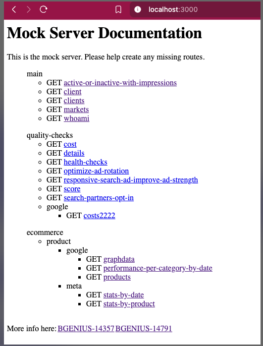
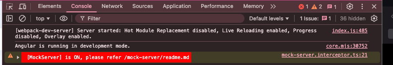
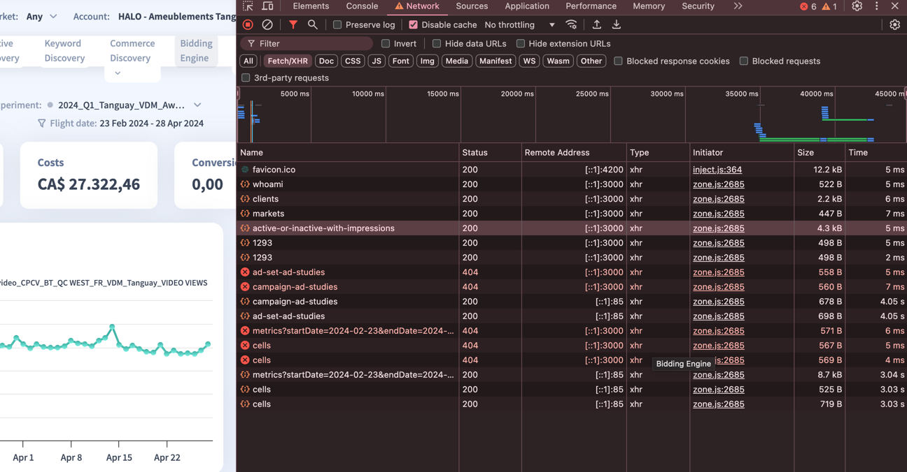
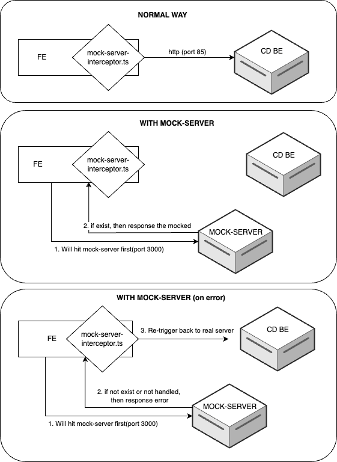

# Mock Server
https://kinesso.atlassian.net/browse/BGENIUS-14357
https://kinesso.atlassian.net/browse/BGENIUS-14791

- cd mock-server
- **_npm install_**
- **_npm start_** to use bGenius authentication  
  &nbsp;&nbsp;&nbsp;or  
  **_npm start-interact_** to use Interact Authentication
  - (both concurrently run FE CD and mock-server)
- open browser and hit `http://localhost:3000/`
 

- make sure to set `localStorage.setItem('mock-server', true)` in browser console
- to turn it off just `localStorage.removeItem('mock-server')` or  `localStorage.setItem('mock-server', false)`
- once enabled you will see this in devtools console 

- 
it is recommended to add remote address column in network tab
    - :3000 it hit mock-server
    - :85 it hit real server
- You can also mimic slow response, global search `mock-server.interceptor.ts`
  ```typescript
    of('something').pipe(
        // delay(1000), // to simulate network delay, just uncomment this line
        switchMap(() => next.handle(tamperedReq))
    ).pipe(...
  ```
- please have a look at `./flow.drawio` for better understanding
  

## Note
- Built with expressjs and mock the response with faker.js.
- it is recommended to use this in local environment only
- once your done the changes, then use the real server and create PR!
- Best practice when dealing with api is to handle 
    - loading
    - error
    - empty
    - success
      - this is not handled in mock-server, so you need to handle it in FE
      - that's where `faker.helpers.weightedArrayElement()` comes in handy. Please have a look how to use it.
